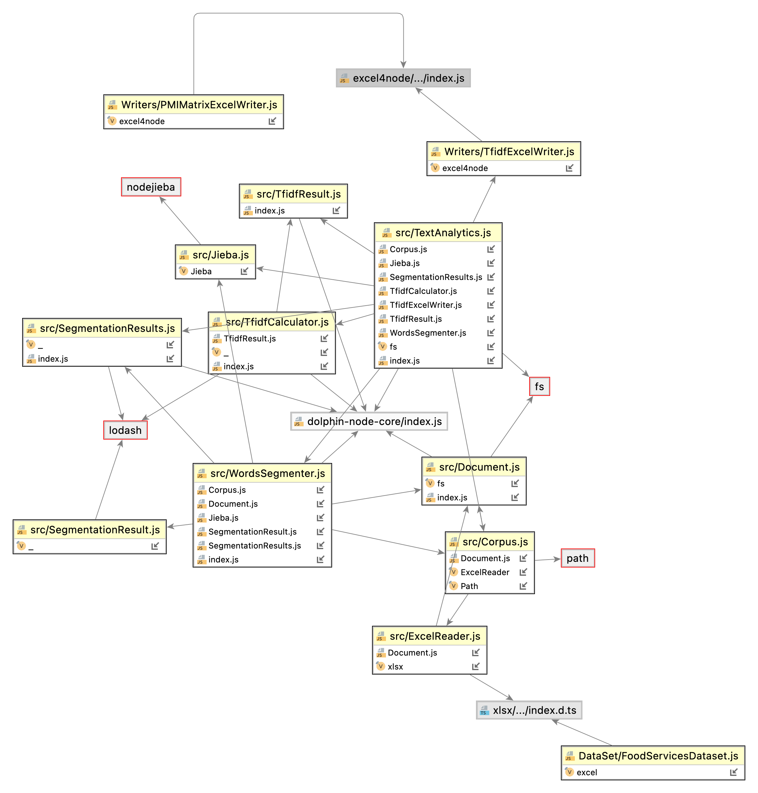

# 介紹

dolphin-node-text-analytics 是一個 npm 文字分析套件，可以分析多份文件產生 tfidf 與 pmi。

## 文件



[詳細的 JSDoc 說明](https://leoshiang.github.io/dolphin-node-text-analytics/)。

## 下載
```bash
npm install dolphin-node-text-analytics
```

## 測試
```bash
npm run test
```
